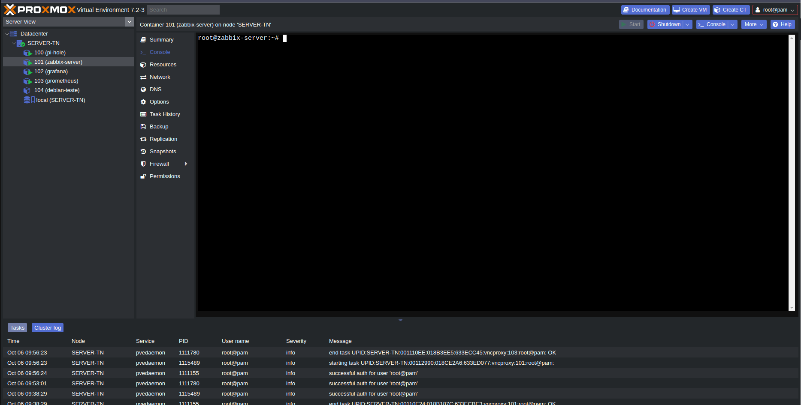
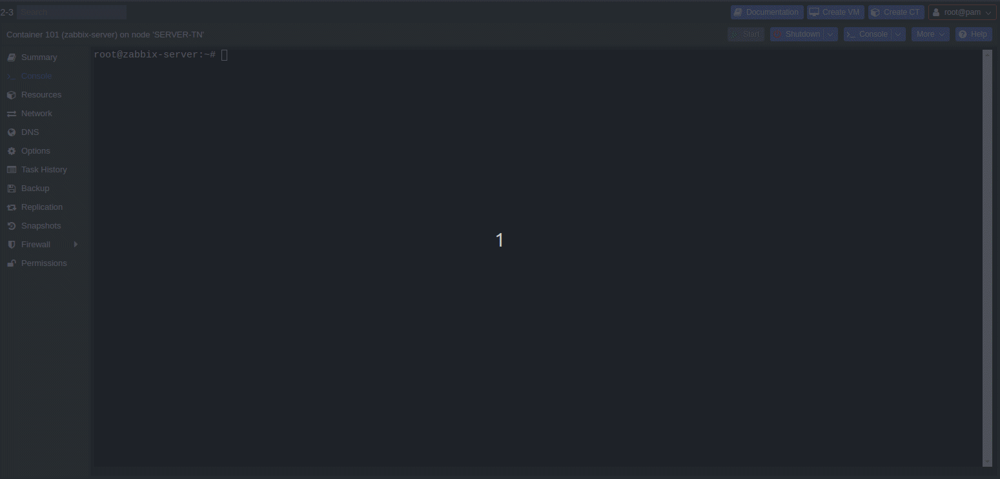
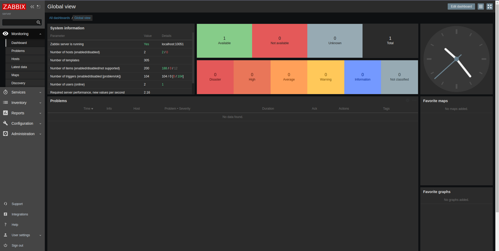
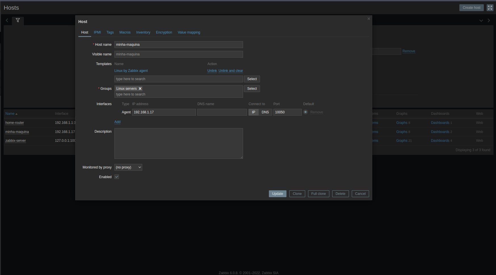
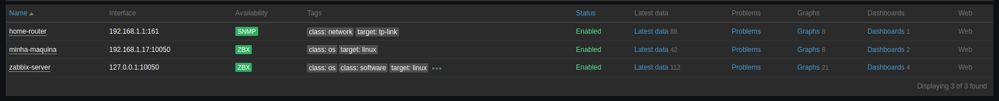

## Hypervisor
Como já tenho uma infraestrutura de virtualização na minha rede interna, utilizei o **PROXMOX** para subir o Zabbix Server. O **proxmox** e um hypervisor de tipo 1, ou seja, ele não precisa de um SO como base para rodar, economizando recursos da maquina onde ele está instalado.

## Instalação do Zabbix 6.0 LTS
Fiz a instalação através do site oficial do zabbix, utilizei a versão 6.0 LTS para **Linux Ubuntu 20.04** utilizando web server **Nginx**.

Link para instalação: [Instalação do Zabbix 6.0 LTS](https://www.zabbix.com/br/download?zabbix=6.0&os_distribution=ubuntu&os_version=20.04&components=server_frontend_agent&db=mysql&ws=nginx)

Instalação completa, instala o servidor, front-end e o agente, como podemos observar, os serviços do zabbix estão rodando no servidor.

## Instalação do Agente no host alvo
Efetuei a instalação do zabbix agent na minha maquina ubuntu 22.04 LTS pelo link: [Zabbix Agent](https://www.zabbix.com/br/download?zabbix=6.0&os_distribution=ubuntu&os_version=22.04&components=agent&db=&ws=).

A instalação e bem simples, assim que for instalado e efetuado o start do serviço, já e possível adicionar a maquina no zabbix. Lembrando de editar o arquivo `zabbix_agentd.config` e alterar o valor da variavel `server` para o **IP/DNS** do Zabbix Server.

Criei novo host e adicionei as as configurações necessárias para ativar o minha maquina via agent.

Aqui podemos observar que a minha maquina ja esta ativa e sendo monitorada pelo Zabbix.

